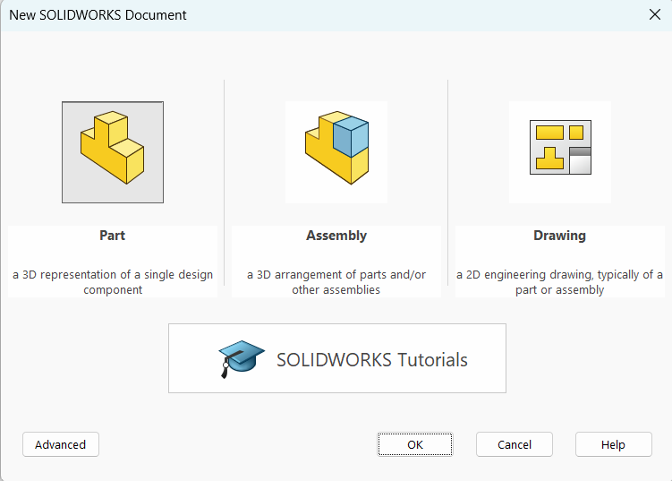
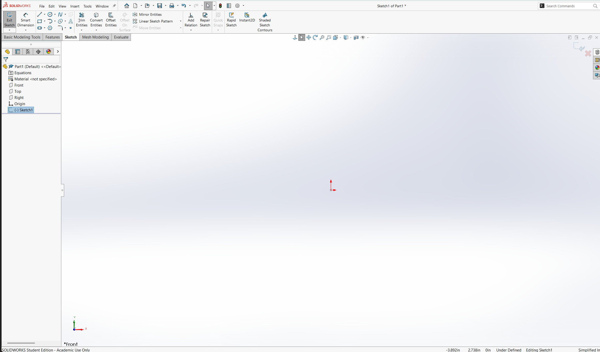
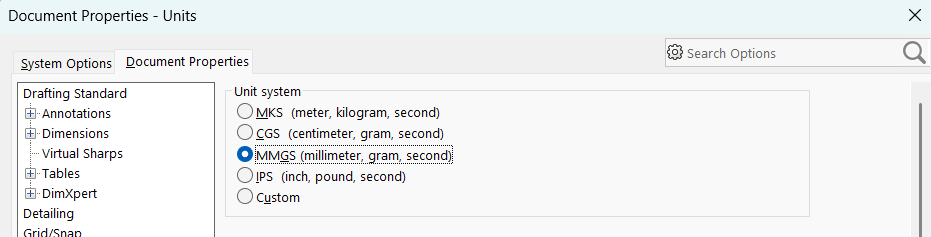
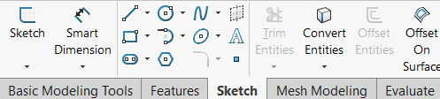
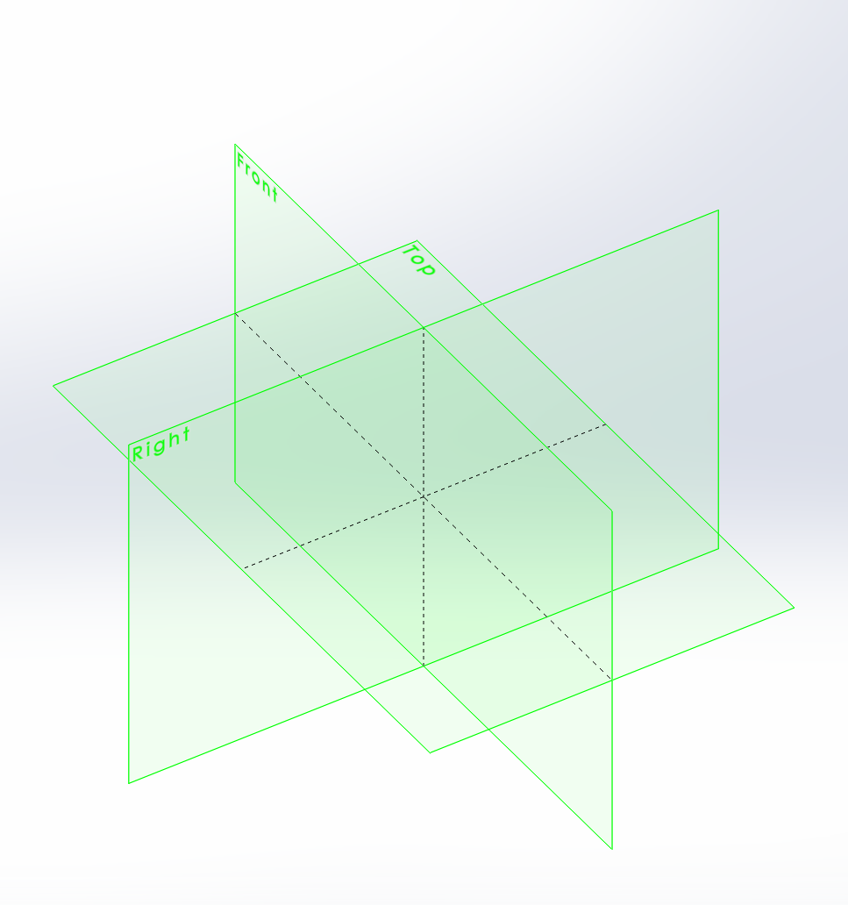
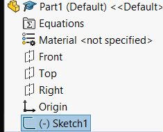
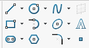

:::tip
    If you are ever stuck reading this lesson, be sure to check the [Solidworks docs](https://help.solidworks.com/2025/english/SolidWorks/sldworks/r_welcome_sw_online_help.htm?id=0), as it has a lot of useful information.
:::
Upon opening Solidworks, the first thing you will see is a mostly empty screen with a toolbar on the top and on the right. To create a [Part](https://help.solidworks.com/2025/english/solidworks/sldworks/c_Overview_and_Editing_Parts_Folder.htm), we can look at the top left of the window and navigate through the menu to `File>New...` (Alternatively pressing `Ctrl-n`).

The window above will open up. For now we will select `Part`, then click `OK`. 

Once inside a part, we will see a lot of new options show up.

On the left is a new sidebar which is by default set to the [Feature Tree](https://help.solidworks.com/2025/english/solidworks/sldworks/c_featuremanager_design_tree.htm), which will show all of the features we add to our model as we go.

The main window is currently empty, however it is called the `Viewport`, and it is where we will be directly creating the 3D models. We can scroll in and out using the scroll wheel, we can rotate the model by holding `MMB (middle-mouse-button)` and moving the mouse, and we can pan the screen with `MMB-Ctrl` while moving the mouse (especially useful for Sketches).

The first thing to check for is the units of the document. In Mechmania, we use metric, but Solidworks often defaults to imperial. If we look up once again at the top toolbar, we can navigate to `Tools>Options>Document Properties>Units`.

We want to set our units to `MMGS`, or to millimetres, grams, and seconds. Once that is done, click `OK` at the bottom of the window.

Now that we have set the units, the first thing we want to do is create a [Sketch](https://help.solidworks.com/2025/english/SolidWorks/sldworks/c_sketching_top.htm?id=28). Sketches are planes on which we can create 2D shapes and contours, which can then be brought into 3D in a variety of ways. 

We can create one by navigating to the `Sketch` tab in the the top left, then clicking the `Sketch` option.

Once clicked, we will see the three reference planes in our viewport window. Reference planes are infinite 2D objects used as a reference for sketches. In every new Part, there exists one for each standard axis, where the Top, Front, and Right planes are along the Y, X, and Z axes, respectively.

We can click on any one of the planes to put our sketch there, and then the view will pan so that the sketch appears in 2D. We will put our first sketch along the front plane, as is standard for most parts. If we accidentally pan off of this view, we can reset it with the command `Ctrl-Space`, which will allow us to re-align our orientation.

Once we click this, we can now see that the sketch has appeared in our Feature Tree. 

To draw on the sketch, we look back up to the top bar, where a number of sketch elements lay.

