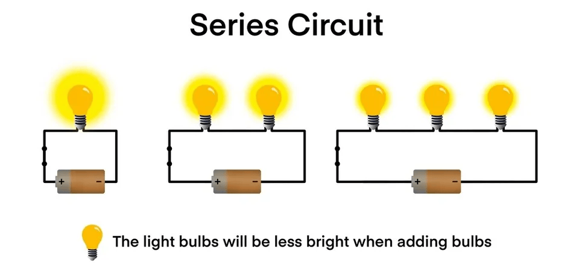
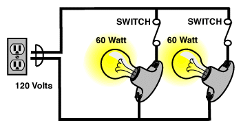

import { Card } from '@astrojs/starlight/components';
import { Image } from "astro:assets";

import batterySymbol from '../../../../assets/lessons/electrical/04/03.png';
import wireSymbol from '../../../../assets/lessons/electrical/04/04.png';
import switchSymbol from '../../../../assets/lessons/electrical/04/05.png';

## Introduction to circuits

The first thing we will learn in this lesson is **what is a circuit**?

In simple words, a circuit is a closed, continuous path through which electricity travels through. 

A circuit is made up of these primary components:

| Symbol | Component Name | Core Usage | Example |
| :---: | :--- | :--- | :--- |
| <Image src={batterySymbol} alt="Power Source" width={65} height={40} />  | **Power Source** | Provides voltage to push electric current | AA Battery, wall outlet |
| <Image src={wireSymbol} alt="Wires / Conductors" width={65} height={30} /> | **Wires / Conductors** | Creates a path for electrons to travel | Copper wire, PCB trace |
| *too many to list* | **Load** | Consumes energy to perform a specific task | LED, motor, buzzer |
| <Image src={switchSymbol} alt="Switch" width={65} height={40} /> | **Switch** | Controls the flow by breaking or completing the loop | Toggle switch, push button |

## Circuit States

| State | Definition | System Behavior |
| :--- | :--- | :--- |
| **Closed** | Complete, unbroken loop | Current flows smoothly and the load operates. |
| **Open** | Broken loop (cut wire/open switch) | Current drops to zero and the load turns off. |
| **Short** | Zero-resistance path to ground | Current bypasses the load entirely. |

:::danger
Please be aware of short circuits. Review [2.2 Standard Conventions](/lessons/electrical/02-standard-conventions/) for safety procedures regarding short circuits.
:::

## Series Circuits

A **series circuit** is a circuit with only one path for current to flow. This means, that if something fails in the circuit, the **entire circuit will fail** because the **one** and only path of current to flow is broken.

The key characteristics of series circuits are:
- Current is **uniform** all throughout: (Iₜₒₜₐₗ = I₁ = I₂ = ...)
- Voltage drops across each load: (Vₜₒₜₐₗ = V₁ + V₂ + ...)

In robotics, battery cells inside a multi-cell pack (like a LiPo) are often wired in series to step up the total voltage. Because they share one path, if one cell fails or a wire disconnects, the entire pack stops supplying power.

Series Circuit (observe the voltage drop):
 

## Parallel Circuits

A **parallel circuit** is a circuit with multiple paths (branches) for current to flow. This means that if something fails in one branch within the circuit, **the entire circuit will not fail** because there are **multiple** paths for the current to flow.

The key characteristics of series circuits are: 
- Voltage is equal in all branches: (Vₜₒₜₐₗ = V₁ = V₂ = ...)
- Current splits in the circuit: (Iₜₒₜₐₗ = I₁ + I₂ + ...)

A great example of parallel circuits are anytime when power sources are shared. Take for example two LEDs, a 5V power source powers both of the LEDs. There are **multiple** paths for the current to flow.

Parallel Circuit (see how the current is split): 
