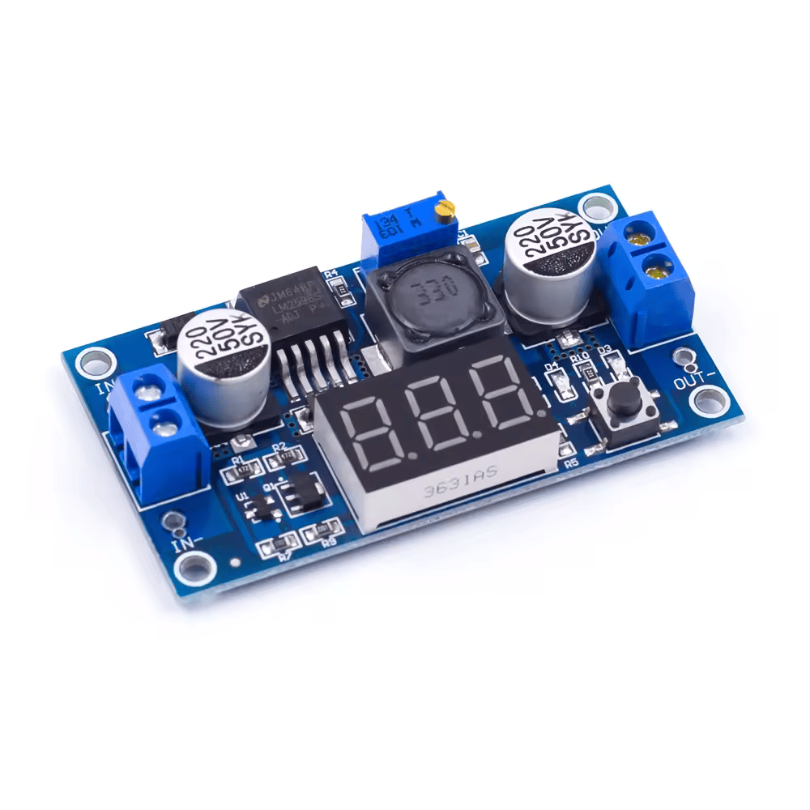

import { Card } from '@astrojs/starlight/components';
import { Image } from "astro:assets";

import buckConverter from '../../../../assets/lessons/electrical/05/01.png';

## Introduction

The first thing we will learn in this lesson is **what is a microcontroller (MCU)**?

In simple words, a microcontroller is a small, self-contained computer built on a single microchip that is built to do one specific job. 

It is very different compared to a desktop computer.

The core components of a microcontroller are:

| Component | What it does |
| :--- | :--- |
| **CPU** | The "brain" that runs your code and handles math. |
| **Flash Memory** | Permanent storage where your program code lives. |
| **RAM** | Temporary memory for holding active variables. |
| **GPIO Pins** | General Purpose Input/Output pins that communicate with hardware. |

## Popular Microcontrollers

There are many different types of MCU's with many different purposes.

However, the most popular, and beginner-friendly MCU's are the following:

- Arduino Uno/Nano/Mega*
- ESP32*
- Raspberry Pi Pico

*Permitted in MechMania

## Safety and Logic Levels

It is important to understand that MCU's communicate using specific electrical voltages representing digital logic (0s and 1s). Older MCU's like the Arduino Uno operate on 5V logic, while newer MCU's like the ESP32 use 3.3V. 

Understanding this difference is **critical to keeping your hardware alive**. 

:::caution
Never hook a 5V component to a 3.3V MCU pin. Doing this will **destroy** the MCU.

The reason for this is because if you connect a higher voltage than the MCU can handle, the excess voltage will be converted to **excess heat and fry the MCU**.
:::

#### Solution

To step down power voltages safely (ex. turning 12V into 5V), use a **Buck Converter**. If you are just trying to convert 5V data signals to 3.3V data signals so sensors can talk to your MCU, use a **Logic Level Shifter** or a **Voltage Divider**.

## GPIO Pin Limits

General Purpose Input/Output (GPIO) pins are designed to transmit **signals**, not raw power. If you plug something heavy to it, it can burn out the pin.

Every microcontroller's GPIO pins have a limit, they vary from microcontroller to microcontroller. It is important that you look into your specific MCU's datasheet to find this information.

It is also important to look into the datasheet to see what pins have what functions. 

:::note
Please make sure to **know the limits of your MCU's GPIO pins** before wiring anything. I have linked the datasheets for the [**ESP32-S3**](https://documentation.espressif.com/esp32-s3_datasheet_en.pdf) and [**Arduino UNO R3**](https://docs.arduino.cc/hardware/uno-rev3/) (which are usable in MechMania) for you to refer to. 
:::
