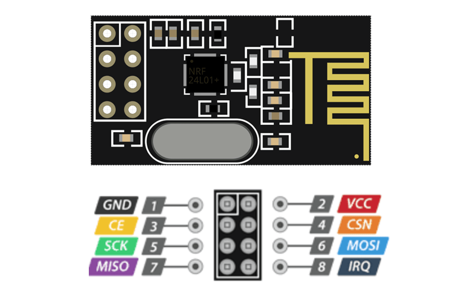

import { Tabs, TabItem } from '@astrojs/starlight/components';

So far we have been operating our microcontrollers independently, with no way to share data with another. We can accomplish this a number of ways, however for this lesson, we will use radio, a method among the simplest ways to accomplish wireless data transfer. For our purposes, we will look primarily at using the [NRF24](https://nrf24.github.io/RF24/) protocol.

### NRF24

We can use the NRF24 protocol on both ESP32 and Arduino boards, however, we need a NRF24L01 module.


:::caution
    Be careful when wiring, as this module is 3.3V, whereas an Arduino runs on 5V logic, and requires a breakout board to interface properly with it.
:::

Consider the pinout diagram above. The pins `CE` and `CSN` can be any pwm-capable digital pin, however the other pins, `MOSI`, `MISO` and `SCK`, usually have defaults  on each board.

We can find these pins for our specific board by printing them out through serial manager.
```c++
#include <SPI.h>

void setup(){
    Serial.print("MOSI: ");
    Serial.println(MOSI);
    
    Serial.print("MISO: ");
    Serial.println(MISO);
    
    Serial.print("SCK: ");
    Serial.println(SCK);
}

void loop(){}

```

To interface with the module in code , we need to use the `SPI.h` and `RF24.h` libraries.

While we need to wire *all* the connections above, since the pins are defaults, we only need to initialize the RF24 class, which is the main communication point with the module, using `CE` and `CSN` in code.
```c++
#include <SPI.h>
#include <RF24.h>

// CE and CSN can be any pwm-capable digital pin
#define PIN_CE 17
#define PIN_CSN 5

RF24 radio(PIN_CE, PIN_CSN);

```

#### Sending
To send data with RF24, we must first set a 5 bit address, which needs to be consistent with the reciever. We can then assign a writing pipe to the address, and start transmitting data.

The example below uses the X and Y axii of a joystick as example data to transmit.
```c++ wrap
#include <SPI.h>
#include <RF24.h>

// CE and CSN can be any pwm-capable digital pin
#define PIN_CE 17
#define PIN_CSN 5

#define PIN_JOYSTICK_X 12
#define PIN_JOYSTICK_Y 13

RF24 radio(PIN_CE,PIN_CSN); 

const byte address[6] = "01011"; // any binary string with 5 bits, identifier for radio frequency, must match reciever

struct [[gnu::packed]] dataStruct {
    int joystick_x;
    int joystick_y;
};

dataStruct data;

void setup() {
  Serial.begin(9600);
  
  if (!radio.begin()) {
    Serial.println("hardware not active");
    while (1);
  }

  radio.openWritingPipe(address); // write to address set above

  radio.setPALevel(RF24_PA_LOW); // Can switch to RF24_PA_MAX if more range and/or signal penetration is needed.
  radio.stopListening();        // Set to transmitter
}

void loop() {
  // get joystick data
  data.joystick_x = analogRead(PIN_JOYSTICK_X);
  data.joystick_y = analogRead(PIN_JOYSTICK_Y);

  // Send the struct package
  // We cast the struct pointer as the first arg and pass its size in bytes as the second.
  bool success = radio.write(&data, sizeof(data));

  delay(50); //20hz refresh loop
}
```

#### Recieving
To receive data with RF24, we match the address of the transmitter, and then we assign a reading pipe to the address. In the main loop, we check if data is available, and if it is, we read it into our data struct.

The example below recieves joystick data from the transmit example above.
```c++ wrap
#include <SPI.h>
#include <RF24.h>

// on arduino uno r3, CE is pin 9, CSN is pin 10
#define PIN_CE 17
#define PIN_CSN 5

RF24 radio(PIN_CE,PIN_CSN); 

const byte address[6] = "01011"; // must match transmitter

struct [[gnu::packed]] dataStruct {
    int joystick_x;
    int joystick_y;
};

dataStruct data;

void setup() {
  Serial.begin(9600);

  if (!radio.begin()) {
    Serial.println("hardware not active");
    while (1);
  } 

  // listen on the address specified above
  radio.openReadingPipe(0, address);
  radio.setPALevel(RF24_PA_LOW);

  radio.startListening(); // listen for signals 
}

void loop() {
    // if data is available, read data into struct
    if (radio.available()) {
        radio.read(&data, sizeof(data));
        
        Serial.print("Joystick X: "); 
        Serial.println(data.joystick_x);

        Serial.print("Joystick Y: "); 
        Serial.println(data.joystick_y);
    }
}
```

