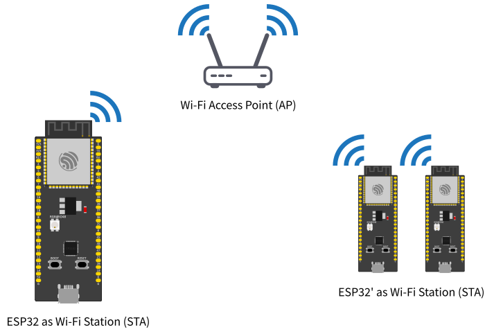
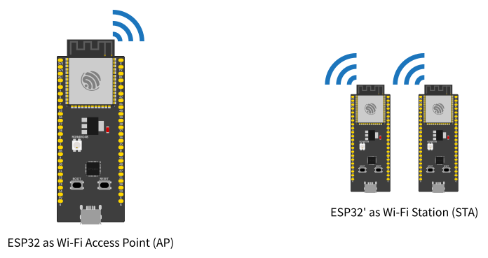

import { Tabs, TabItem } from '@astrojs/starlight/components';

WiFi is everywhere, and our personal devices use it to communicate all of the time. We can use connect microcontrollers to modules to connect to WiFi networks, create them, and send signals along them. Often, for boards such as the ESP32, we do not even need any external modules, and can connect directly. 

:::caution
For the purposes of this lesson, we will only be going over the built-in WiFi on the ESP32 chip. If you would like to change this, please [contribute](/getting-started/contributing)!
:::

There are many different protocols involved with networking as a whole, however for our purposes, we will stick with UDP (User Datagram Protocol) and TCP (Transmission Control Protocol).

## Wifi Setup
<Tabs syncKey="boards" >
<TabItem label="ESP32">

To use WiFi on the ESP32, we use the [WiFi.h](https://docs.espressif.com/projects/arduino-esp32/en/latest/api/wifi.html) library.

### Client


If we wish to set up an ESP32 as a client to connect to a network, we must set it up as a `wifi station`, or `station mode`.
We must pass the name and password of the wifi network we wish to connect to to the init function.

```c++
#include <Wifi.h>

const char* ssid = "Funky_Network_Name";
const char* password = "Password123"; // Leave empty for open network

void setup(){
    Serial.begin(9600);
    
    // Connect to WiFi network
    WiFi.begin(ssid,password);
    
    // Wait until WiFi is connected 
    while (WiFi.status() != WL_CONNECTED) {
        delay(500);
        Serial.print(".");
    }
        
    Serial.print("Connected!");
    
    Serial.println("IP address: ");
    Serial.println(WiFi.localIP());
};

void loop(){};
```


### Server



If we wish to set up the ESP32 as a WiFi server, wherein other devices connect to it (as in the diagram above), we must set the WiFi name, password, and then set it up as an `access point` or, `soft AP mode`.

```c++
#include <Wifi.h>

const char* ssid = "Funky_Network_Name";
const char* password = "Password123"; // Leave empty for open network

void setup(){
    WiFi.softAP(ssid,password);
    
    // print out the IP address of the network
    Serial.print("Wifi IP address: ");
    Serial.println(WiFi.softAPIP());
};

void loop(){};
```

While an Esp32 is running the code above, you should be able to detect and connect to the WiFi network run by it.

</TabItem>
<TabItem label="Desktop">


</TabItem>
</Tabs>

## Data Transfer
At the moment however, while we have a connection, we are unable to send and recieve data. The two simplest and most versatile tools to accomplish this are UDP and TCP.

UDP is a connectionless system, so it will not retry lost packets, will not handshake to ensure its destination exists, and will not guarantee any specific packet order. It is generally used in applications where speed and low-latency applications (such as real-time controls), as it is faster to send and recieve, and faces much less risk of stalls than systems which require connections, as they can get stuck in a retry loop for relatively long periods of time before continuing to a new packet.

UDP sends data on a system of independent packets, where each is self-contained and has a fixed size.

TCP is the reverse. It requires a digital handshake before sending data, and will retry lost bytes sent. On the recieving end, data is also reconstructed in the order which they were sent. It is much slower and more vulnerable to stalls than UDP, but with it data transfer is reliable and has much lower packet loss.

TCP, since it has a constant connection, can send data into a stream, which is then consumed byte by byte by the reciever.

<Tabs syncKey="boards">
<TabItem label="ESP32">

To read or write any UDP or TCP data from an ESP32, we use the `Network.h` library from Espressif's [Network API](https://docs.espressif.com/projects/arduino-esp32/en/latest/api/network.html#networkudp).


#### UDP

Using this library we can create a `NetworkUDP` object.

```c++
#include <Network.h>
NetworkUDP UDP;
```


##### Sending

To send data over UDP, we must package our data, then send it over discrete Packets.

```c++ wrap
#include <WiFi.h>
#include <Network.h>
#include <cstdint>

const int port = 8888; // Port which data is sent to

const char destinationIP[] = "192.168.4.1"; // Either the access point IP of the connected server (if client), or the local IP of a connected client (if server)

// Struct through which to package data. All objects in the must have a static memory size.
// Must be the same struct as is being recieved.
struct [[gnu::packed]] dataStruct {
    char text[16];
}

dataStruct data;

void setup(){
    // ... Setup WiFi connection (either server or client)
}

void loop(){
    
    udp.beginPacket(destinationIP, port); // Begin the packet to a destination IP and port
    udp.write((const uint8_t*)&data, sizeof(dataStruct)); // Write all the bytes of the container struct to the packet
    udp.endPacket(); // Close and send the datagram to the destination
    
    delay(20); // 50hz message loop
}   
```

##### Recieving

To recieve data over UDP, we must first create a listener on the port each datagram is being sent to. Since each packet is discrete, we can simply read a fixed amount of bytes from each packet to get the required data, in this case the size of the dataStruct.

```c++ wrap
#include <WiFi.h>
#include <Network.h>
#include <cstdint>

const int port = 8888; // Port to listen on for data

struct [[gnu::packed]] dataStruct {
    char text[16];
}

dataStruct data;


void setup(){
    // ... Setup WiFi connection (either server or client)
    
    udp.begin(port); // Listen on the port for datagrams
}

void loop(){
    int packetSize = udp.parsePacket(); // Read packet
    if (!packetSize) return; // If no packet, then return
    

    // If packet exists, then read sizeof(dataStruct) bytes into `data`
    udp.read((uint8_t*)&data, sizeof(dataStruct));
    
    // Print recieved text
    Serial.println(data.text); 
}

```

#### TCP

To read and write TCP data, we use the `NetworkServer` and `NetworkClient` classes from the above `Network.h` library. 

```c++
#include <Network.h>

const int port = 8888;

NetworkServer TCPServer(port); // for reciever 
NetworkClient TCPClient;
```

##### Sending

```c++ wrap
#include <WiFi.h>
#include <NetworkUDP.h>
#include <cstdint>

// Struct through which to package data. All objects in the must have a static memory size.
// Must be the same struct as is being sent.
struct [[gnu::packed]] dataStruct {
    char text[16];
}
dataStruct data;

const int port = 8888; // Port which data is sent to
const char destinationIP[] = "192.168.4.1"; // IP of the recieving server
const char* ssid = "Funky_Network_Name";
const char* password = "Password123"; // Leave empty for open network

NetworkClient TCPClient;

void setup(){
    Serial.begin(9600);
    
    // Connect to WiFi network
    WiFi.begin(ssid,password);
    
    // Wait until WiFi is connected 
    while (WiFi.status() != WL_CONNECTED) {
        delay(500);
        Serial.print(".");
    }
        
    Serial.print("Connected!");
    
    Serial.println("IP address: ");
    Serial.println(WiFi.localIP());
}

void loop(){
    if (client.connect(destinationIP, port)) {
        // Write data to stream
        client.write((const uint8_t*)&data, sizeof(dataStuct));
        
        // End transmission
        client.stop();
    }
}   
```

##### Recieving


```c++ wrap
#include <WiFi.h>
#include <Network.h>
#include <cstdint>

struct [[gnu::packed]] dataStruct {
    char text[16];
}
dataStruct data;

const char* ssid = "Funky_Network_Name";
const char* password = "Password123"; // Leave empty for open network

const int port = 8888;

NetworkServer TCPServer(port); // for reciever 

void setup(){
    Serial.begin(9600);
    
    // Setup WiFI server

    WiFi.softAP(ssid,password);
    
    // print out the IP address of the network
    Serial.print("Wifi IP address: ");
    Serial.println(WiFi.softAPIP());
    
    // Begin the TCP server
    TCPServer.begin(port);
}

void loop(){
    NetworkClient client = server.accept();
    if (client) {
        while (client.connected()) {
            // Wait until bytes available in stream are equal to the number of bytes expected, which is the number of bytes in the container struct.
            if (client.available() >= sizeof(dataStruct)) {
                
                // Read TCP transmission bytes
                client.read((uint8_t*)&data, sizeof(dataStruct));
                
                Serial.println(data.text);
            }
        }
        client.stop();
    }
}

```

</TabItem>
<TabItem label="Desktop">

#### UDP


#### TCP


</TabItem>
</Tabs>
