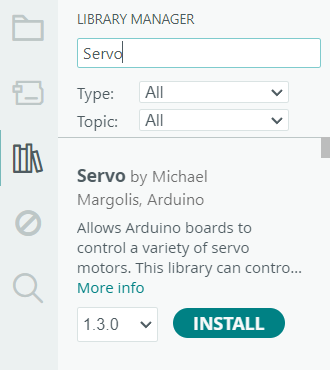

import { Tabs, TabItem } from '@astrojs/starlight/components';


For the purpose of this lesson, we will be using the [Servo](https://docs.arduino.cc/libraries/servo/) library, which allows generated data to be persistently stored on our Arduino or ESP32.


Now that we know which library we want to install, we need to first verify that it runs on our board. This specific library will run *only* on Arduino boards. For this example, that works perfectly.

We can now open the Arduino IDE and enter the library manager through the navigation bar on the left.


Enter `Servo` into the search bar. The first result should be a library by `Michael Margolis, Arduino.` Click the `Install` button and it should install the library for you.

Now, to use the functions provided by the library, you include it at the top of your code like this:
```c++
#include <Servo.h>
```
