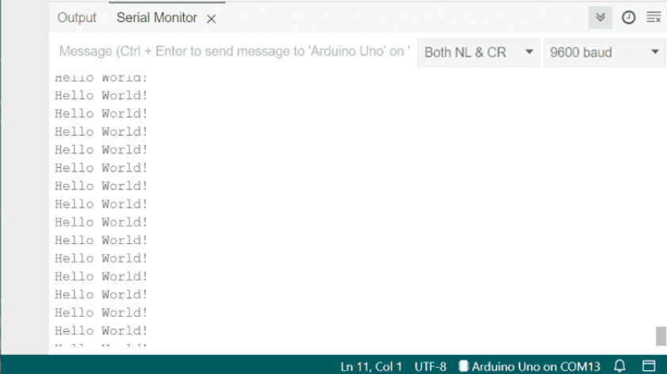

:::caution
    It is recommended that you have read [2.6 Microcontrollers](/lessons/u2-electrical/26-microcontrollers/) before starting this lesson.
:::

:::tip
    In addition to following this lesson, we recommend also reading the [Arduino Language Reference](https://docs.arduino.cc/language-reference/) to clear up gaps and search for any individual function you should need.
:::


### Code Structure

In any code run with the Arduino IDE, no matter the microcontroller, the code has a base structure as such:

```c++
void setup(){
    //Will run once on startup before anything else.
}

void loop(){
    //Will loop for as long as the MCU is powered
}
```

Without these two functions, no code will flash to or run on an MCU through the Arduino IDE (though other protocols are different).


### Serial

To communicate data from the MCU back to our computer through the wired connection, we can't use `cout << "data"` like we would in regular c++. Instead we use Serial.

Here is a snippet showing it's usage:
```c++

const int data = 5;

void setup(){
    Serial.begin(9600);             // Begin at a baud rate of 9600
    Serial.println("Hello World! (setup)"); // Prints some text, with a newline
    Serial.print("Some data: ");    // Prints some text, without a newline, so that the next text will appear on the same line
    Serial.println(data);           // Can also print simple variables, such as integers, longs, floats, chars, strings, and doubles.
}

void loop(){
    Serial.println("Hello World!");
    delay(500); // Delays the mainloop by 500ms
}
```
We start Serial by using the `Serial.begin(int baud);` command. The baud rate is the speed of data transmission between two devices, in this case the MCU and the computer, and must match for effective data transmission. In the case of the program above, we use the standard value of `9600`.

To write data to serial, we can use the two functions `Serial.print();` amd `Serial.println();` shown above, as well as numerous others, which you can learn more about [here](https://docs.arduino.cc/language-reference/en/functions/communication/serial/). The list of functions should be at the bottom of the page.

To actually read the serial data, you can open the serial monitor on the IDE by clicking this icon in the top right: 


From there, you will be able to see every message that is sent through Serial from the MCU. If you do not see anything, try and check your connection to the MCU.
Be sure to set the baud rate to 9600, so that the messages get through.

.


### Input/Output

To control and communicate with circuits, we use the GPIO (general purpose input/ouput) pins on the MCU. With them, we can read and write signals.

By default, pins are setup as input. We can configure this in the setup function with the `pinMode(int pin, int pinMode)`

```c++

void setup(){
    // To configure pin 13 to be output
    pinMode(13, OUTPUT);

    // To configure pin 12 to be input
    pinMode(12, INPUT);
}

```


#### Digital


#### Analog


### PWM
